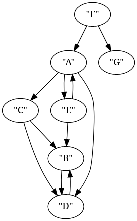
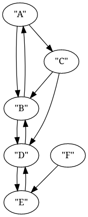
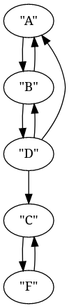

# Program input

The program expects a path to a json file which contains a serialized graph.
Optionally after the filename a name of the node can be provided to have the
program check that single node as a candidate for an initiator instead of
running for a whole graph.

# Executing

Suggested:
```sh
cargo run --bin task1 -- inputs/task1/example1.json F
```

Otherwise check the [README of the workspace](../../README.md) for more details on
executing the compiled binary.

# Provided examples

[`inputs/task1/example1.json`](../inputs/task1/example1.json)


[`inputs/task2/example1.json`](../inputs/task1/example2.json)


[`inputs/task3/example1.json`](../inputs/task1/example3.json)
