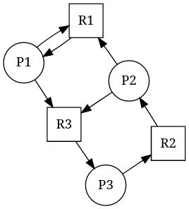
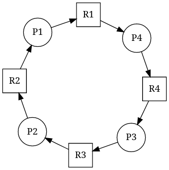
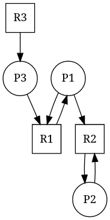

# Program input

The program requires a path to an input file (json) format as its first
argument. The format describes the relationships between processes and
resources spread between multiple sites.

# Provided examples


##### Example 1
[`inputs/task4/example1.json`](../inputs/task4/example1.json)  
  
A somewhat random-looking example of a deadlock.
```
Reading from file inputs/task4/example1.json
Recorded wait-for-graph:
{P3: [P2], P2: [P1], P1: [P3]}
Recorded status table:
{P2: {R2: InUse, R3: Requested, R1: Requested}, P3: {R3: InUse, R2: Requested}, P1: {R1: InUse, R3: Requested}}
Found cycles causing deadlocks.
Found deadlock invloving nodes: [P3, P2, P1]
```
The output can be non-deterministic, most likely because of the free ordering
of elements used by the deserialization library. It might be observable on the
example1. Nodes reported to be in the cycle might vary between executions but
the detection is correct.

##### Example 2
[`inputs/task4/example2.json`](../inputs/task4/example2.json)  
  
A ring-like deadlock composed of 4 nodes and 4 resources.
```
Reading from file inputs/task4/example2.json
Recorded wait-for-graph:
{P2: [P1], P3: [P2], P1: [P4], P4: [P3]}
Recorded status table:
{P3: {R3: Requested, R4: InUse}, P4: {R4: Requested, R1: InUse}, P1: {R1: Requested, R2: InUse}, P2: {R2: Requested, R3: InUse}}
Found cycles causing deadlocks.
Found deadlock invloving nodes: [P2, P1, P4, P3]
```

##### Example 3
[`inputs/task4/example3.json`](../inputs/task4/example3.json)  
  
Not a deadlock.
Program output:
```
Reading from file inputs/task4/example3.json
Recorded wait-for-graph:
{P1: [P2], P3: [P1]}
Recorded status table:
{P2: {R2: InUse}, P1: {R2: Requested, R1: InUse}, P3: {R1: Requested, R3: InUse}}
No cycles found
```

##### Example 4
[`inputs/task4/example3.json`](../inputs/task4/example3.json)  
An example combining all the previous examples in such a way that three
disconnected wait-for-graphs are constructed.
Program output:
```
Reading from file inputs/task4/example4.json
Recorded wait-for-graph:
{P7: [P10], P8: [P7], P6: [P4], P4: [P5], P2: [P3, P1], P9: [P8], P10: [P9], P3: [P2]}
Recorded status table:
{P3: {R3: InUse, R2: Requested}, P8: {R9: InUse, R8: Requested}, P4: {R4: InUse, R5: Requested}, P7: {R7: Requested, R8: InUse}, P9: {R9: Requested, R10: InUse}, P10: {R7: InUse, R10: Requested}, P1: {R3: Requested, R1: InUse}, P6: {R4: Requested, R6: InUse}, P5: {R5: InUse}, P2: {R2: InUse, R1: Requested, R3: Requested}}
Found cycles causing deadlocks.
Found deadlock invloving nodes: [P3, P2]
Found deadlock invloving nodes: [P8, P7, P10, P9]
```

# Implementation

The program uses `HashMap`s in place of matrices to improve the lookup time,
simplify the code and keep track of all assigned labels so that the output
stays readable. It also attempts to identify all the cycles and return 
invloved nodes. To detect cycles it uses DFS with coloring of nodes as
described e.g. [here](https://www.geeksforgeeks.org/detect-cycle-direct-graph-using-colors/)
but with no backtracking as that was considered not to improve much the output.